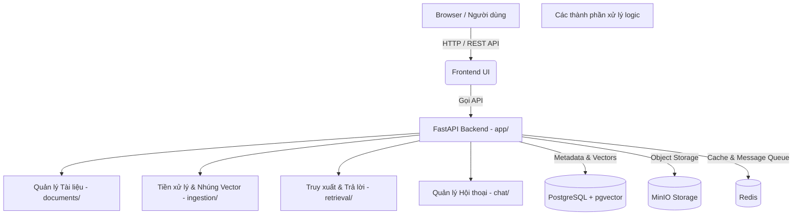

# RAG System Monolith

Dự án này là một hệ thống RAG (Retrieval-Augmented Generation) nguyên khối, bao gồm cả Frontend và Backend, kết hợp với các dịch vụ lưu trữ dữ liệu ngoài (PostgreSQL, MinIO, Redis).

## 🏗 Sơ đồ kiến trúc hệ thống (Architecture)



## 📁 Cấu trúc thư mục (Directory Structure)

```text
rag/
├── app/               # ⚙️ Chứa toàn bộ source code Backend (FastAPI)
│   ├── chat/          # Quản lý phiên chat và hội thoại của LLM
│   ├── documents/     # Quản lý tệp tin (upload/download lên MinIO)
│   ├── ingestion/     # Tách cụm (chunk), tạo embedding (vector) và nội suy file
│   ├── retrieval/     # Thực hiện tìm kiếm tìm ngữ nghĩa, tạo prompt cho LLM
│   ├── shared/        # Các tiện ích xài chung (storage, security)
│   ├── main.py        # Entry point khởi chạy API
│   ├── database.py    # Cấu hình kết nối DB
│   └── celery_app.py  # Cấu hình Task Queue (ví dụ: quét tài liệu nền)
├── frontend/          # 🎨 Chứa source code giao diện người dùng
├── alembic/           # 🗄️ Quản lý và theo dõi lịch sử schema Database (Migrations)
├── docker-compose.yml # 🐳 file khởi tạo Postgres, Minio, Redis
├── pyproject.toml     # 📦 Quản lý dependencies (với uv)
├── start.sh           # 🚀 Script khởi chạy FastAPI Backend nhanh
└── .env               # 🔑 Chứa môi trường & mật khẩu (Không đưa lên Git)
```

## 🚀 Hướng dẫn chạy dự án nền (Backend)

1. Khởi chạy các cơ sở dữ liệu nền (Postgres, MinIO, Redis):
```bash
docker compose up -d
```

2. Cài đặt các thư viện bằng `uv`:
```bash
uv sync # (hoặc add thêm package: uv add <thư_viện>)
```

3. Áp dụng thay đổi cơ sở dữ liệu và khởi động Backend:
```bash
./start.sh
```

4. Trang tài liệu API (Swagger UI): `http://localhost:8000/docs`
